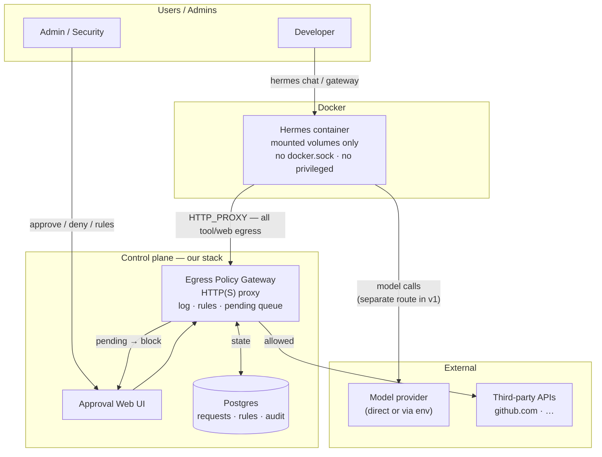
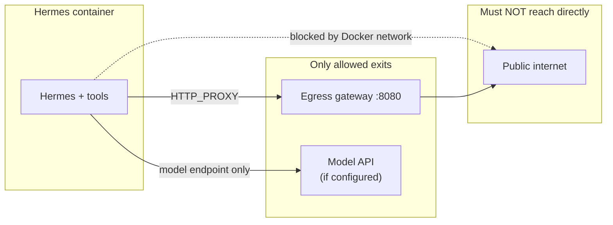
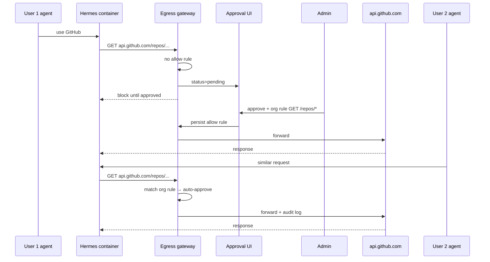
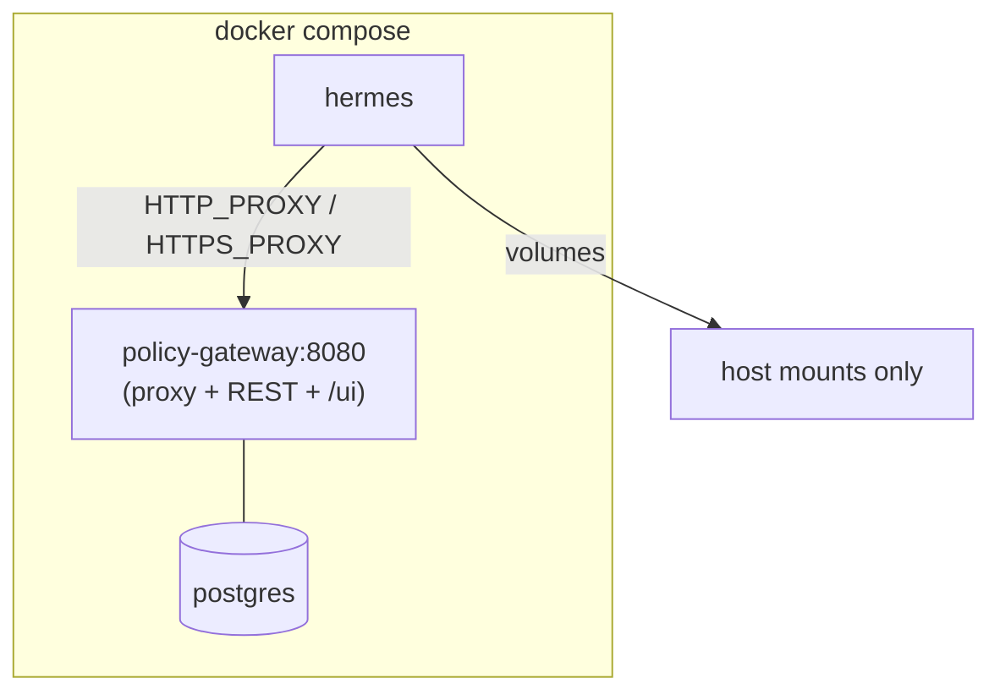

# Clearance — Agent Handoff Document

> **For coding agents:** Read this entire file before writing code, suggesting architecture changes, or installing third-party platforms. This is the source of truth for a **new product** that lives alongside (not inside) the Portfolio Website Next.js app.

---

## How to use this document

| Section | When to read |
|---------|----------------|
| [Executive summary](#executive-summary) | First — 60-second orientation |
| [Origin & context](#origin--context-why-this-exists) | Before proposing solutions — avoids repeating failed paths |
| [Strategic decisions (locked)](#strategic-decisions-locked) | Before choosing LAP fork, OpenShell, NemoHermes, etc. |
| [Common agent mistakes](#common-agent-mistakes-do-not-do-these) | Before implementing |
| [Architecture](#architecture-v1) | When designing services |
| [Policy & data model](#policy-model) | When building gateway + DB |
| [MVP & acceptance criteria](#mvp-phases--acceptance-criteria) | When scoping work |
| [References](#external-references) | When integrating Hermes or borrowing patterns |

**Conflict resolution:** If the user’s latest message conflicts with **Strategic decisions** or **Non-goals**, follow this file and ask for clarification.

**Repo note:** Spec lives at `docs/specs/hermes-policy-gateway.md` in **[clearance](https://github.com/meghamshb2006/clearance)**. Implementation is under `services/policy-gateway/` with Compose at repo root. Gateway version: `0.6.1-phase4` (see `GATEWAY_SERVICE_VERSION`).

---

## Executive summary

**Product:** A deployable **egress policy gateway** + **approval web UI** so Hermes agents running in Docker cannot reach the internet without logging, human approval, and optional shared org allow rules.

**One sentence:** Run Hermes in Docker with only mounted files visible; force all outbound HTTP(S) through our gateway; admins approve/deny in a UI; User 2 reuses User 1’s approved host/path patterns at org scope.

**Wedge:** **Monitorability** — corporate teams cannot trust agents on laptops because they cannot see or gate network calls. NemoHermes/OpenShell solve this with heavy infra. LiteLLM Agent Control Plane (LAP) solves agent orchestration but **not per-request HTTP egress**. We build the missing egress layer.

**v1 decision:** Build our gateway first. **Do not fork LAP.** Reference LAP’s Hermes Docker template and inbox UX only.

**Implementation status (2026-08-19):** **Phases 0–4 complete.** Runnable stack: `docker compose up --build` + `make smoke`. Policy gateway (Go), Postgres, React approval UI at `/ui`, **real Hermes agent** in Docker (terminal-tool egress through gateway). Org rules, manual rule bootstrap, expires_at, cross-agent org rules, approve-once, deny, audit, and rule revoke are implemented. **Not done:** production auth/SSO (Phase 5), fleet control plane, separate model egress network (Option B — documented, not wired in Compose yet).

---

## Origin & context (why this exists)

### What the user was trying to solve

The user explored running **Hermes** (Nous Research agent) on a Mac for personal/corp use. Pain points discovered in prior sessions:

1. **NemoHermes + OpenShell** works but is **too complex** to deploy (gateway recover, onboard, `inference.local`, sandbox recreate wipes OAuth, etc.).
2. **Monitorability** is the core gap: when an agent calls `api.github.com`, there is no simple inbox where a human approves it and a second user benefits from that approval.
3. **Corporate risk:** running agents directly on a laptop with full filesystem and network access is unacceptable; Docker + controlled mounts + gated egress is the desired shape.
4. **ChatGPT Plus / Codex OAuth** is a Hermes-native auth path (`hermes auth add openai-codex`) — **not** the same as OpenShell “default inference provider” or `nemohermes inference set`. That distinction caused confusion; this project does not require solving Codex OAuth in v1, but Hermes-in-Docker must remain compatible with it later.
5. **Ollama / qwen** was used as local inference via NemoHermes; user is moving away from that. This product is **not** about local LLMs — it’s about **network policy**.

### User intent evolution (chronological)

| Phase | User asked for | Outcome / lesson |
|-------|----------------|------------------|
| 1 | Hermes via NemoHermes on Mac | Works but fragile after reboot; recover recreates sandbox |
| 2 | ChatGPT Plus / Codex as “default inference” | Codex OAuth lives **inside** Hermes sandbox; not an OpenShell `inference set` provider |
| 3 | Custom gateway like OpenShell approvals | Valid product idea — **egress gate + UI**, not OpenShell itself |
| 4 | Fleet control plane for many laptops | Broader vision; v1 is **single-host Compose**, fleet later |
| 5 | Use LAP as starting point | Compared; **don’t fork** — build egress layer, reference LAP patterns |
| 6 | Document for next agent | This file |

### What “success” looks like for the user

- `docker compose up` on a corp laptop → Hermes in container → agent tries external API → **request appears in web UI** → human approves → traffic flows → **audit log** exists.
- Second developer’s agent hits same API pattern → **auto-approved** via org rule, still logged.
- No OpenShell install, no `nemohermes onboard`, no kernel policy YAML.

---

## Strategic decisions (locked)

These are **not** open for reversal in v1 unless the user explicitly changes direction.

### 1. Build egress gateway first; do not fork LAP

**[LiteLLM Agent Control Plane](https://github.com/LiteLLM-Labs/litellm-agent-control-plane)** (~1.2k stars, Aug 2026) provides:

- Unified UI/API for multiple agent runtimes (including Hermes via `--profile hermes`)
- Postgres, sessions, LLM gateway, MCP proxy, **tool-level** approval inbox
- Hermes bridge template (`templates/hermes`) — Hermes behind “Claude Managed Agents” API; models route through LAP

**It does NOT provide:**

- Mandatory HTTP(S) egress proxy for all agent traffic
- Per-request approval by host/method/path
- Docker network lockdown so Hermes cannot bypass the proxy

**Decision:** Reference LAP; **do not fork**. Our code is the egress gateway.

**Decision rule:** Pitch = “gate every network call” → this product. Pitch = “full agent platform” → different product (revisit LAP then).

### 2. Do not use NemoHermes / OpenShell as the platform

User explicitly rejected deployment complexity. Copy the **product job** (egress visibility + human approval), not the software.

### 3. Hermes in Docker is required for this product

Hermes can run bare-metal; **this project requires containerization** for isolation story.

### 4. Two different “gateways” — never conflate

| Name | What it is | Our relationship |
|------|------------|------------------|
| **Hermes gateway** | Hermes chat/API (`hermes gateway run`) | Keep; we don’t replace it |
| **OpenShell gateway** | mTLS sandbox control plane | Out of scope |
| **LAP gateway** | LLM + MCP + platform API | Optional neighbor in v2 |
| **Egress policy gateway** | **Our product** — HTTP(S) proxy + approvals | Build this |

Pointing Hermes “gateway URL” at OpenShell or our proxy as if it were a chat server **will not work**.

### 5. Optional v2: LAP beside our stack

```text
Hermes → Egress Policy Gateway → internet (tools, web, APIs)   ← v1 core
Hermes → LAP /v1/messages       → models                      ← v2 optional
```

---

## Problem statement (detailed)

### Primary problem: agent monitorability

When an AI agent runs on a developer machine:

- Tooling and web fetch generate **opaque outbound HTTP(S)**.
- Security/compliance cannot **see** what left the machine.
- There is no **human-in-the-loop** gate before a new destination is contacted.
- There is no **durable allowlist** shared across users (“User 1 approved GitHub API for the org”).

### Secondary problem: deployability

Existing solutions that partially address isolation/policy:

| Solution | Monitorability | Deploy complexity | Fit for corp laptop |
|----------|----------------|-------------------|---------------------|
| NemoHermes + OpenShell | Strong (kernel policy) | Very high | Poor |
| LAP | Tool/MCP approvals only | Medium | Partial — no egress gate |
| Hermes alone | None | Low | Poor for corp |
| **Our egress gateway** | Strong (HTTP layer) | Low (Compose) | **Target fit** |

### Non-problem (out of scope for v1)

- Replacing OpenAI/Anthropic billing or Codex OAuth flows
- Building a new LLM router (LiteLLM already exists)
- Cloning robbyyeager.com portfolio site (different project in this repo)

---

## Goals

1. Hermes runs **only inside Docker** on the host.
2. Container sees **only explicitly mounted** directories (read-only by default where possible).
3. Container **cannot reach the public internet** except via **egress policy gateway** (proxy env + Docker network enforcement).
4. Gateway **logs every outbound HTTP(S) request** with: method, host, path, agent_id, user_id, timestamp, decision, rule_id (if auto-approved).
5. **Web UI** lists pending requests; humans approve or deny.
6. On approve, optional **org-scoped allow rule** (host + method + path prefix) so other users/agents skip re-approval.
7. **Single `docker compose up`** deploys gateway + UI + DB + Hermes template.
8. **Audit trail** for compliance: who approved, when, what pattern was saved.

---

## Non-goals (v1 — do not implement)

### Platform / dependencies

- Do **not** fork or submodule **LiteLLM Agent Control Plane**.
- Do **not** depend on **NemoHermes, NemoClaw, or OpenShell**.
- Do **not** require `nemohermes onboard` or `openshell-gateway` on the host.

### Product scope

- Do **not** build a full multi-runtime agent platform (Slack, cron, fleet UI, A2A) in v1.
- Do **not** replace Hermes chat UI or `hermes gateway` protocol.
- Do **not** make the gateway an LLM or inference router (policy proxy only).

### Security scope

- Do **not** implement Landlock/seccomp/OPA (OpenShell-grade) in v1.
- Do **not** mount Docker socket into Hermes container.
- Do **not** run Hermes `--privileged`.
- Do **not** store secrets in allow rule keys (no query strings, no Authorization headers in rule patterns).

### Policy scope

- Do **not** auto-allow full URLs with embedded tokens as reusable rules.
- Do **not** silently allow unknown hosts in production mode (default deny pending approval).

### Repo scope

- Do **not** merge this into Portfolio Website `src/` unless user asks.

---

## Common agent mistakes (do not do these)

Agents helping the user previously went down wrong paths. **Avoid repeating:**

| Mistake | Why it’s wrong |
|---------|----------------|
| `nemohermes onboard --resume` to fix gateway | Resume only continues interrupted onboard; gateway restart is separate |
| `openshell gateway start` on OpenShell 0.0.85 | Subcommand may not exist; use `openshell-gateway` binary with toml |
| Point Hermes at `https://chatgpt.com` as API endpoint | Not OpenAI-compatible; 403 |
| `nemohermes inference set --provider openai-codex` | Codex OAuth is **Hermes-internal**, not OpenShell inference provider |
| Fork LAP and call it done | LAP lacks egress gate; fork doesn’t build core feature |
| Rely on `HTTP_PROXY` alone | Agent or libs can ignore; need **Docker network** restriction |
| Use NemoHermes recover in prod without expecting sandbox wipe | Recreate destroys in-sandbox OAuth (`/sandbox/.hermes/auth.json`) |
| Treat Plus subscription as API key | ChatGPT Plus ≠ OpenAI Platform API billing |
| Install Codex CLI on Mac as requirement | Hermes OAuth is in-container; Codex app optional |

---

## Glossary

| Term | Definition |
|------|------------|
| **Hermes** | [Nous Hermes Agent](https://github.com/NousResearch/hermes-agent) — CLI/agent runtime with tools, gateway, OAuth providers including `openai-codex`. |
| **Hermes gateway** | Hermes’s own HTTP API for chat/sessions (`hermes gateway run`). **Not our product.** |
| **Egress policy gateway** | **Our v1 product:** HTTP(S) forward proxy + policy engine + approval queue + audit API. |
| **Approval Web UI** | Human inbox for pending network requests + rule management + audit views. |
| **Allow rule** | Persistent policy: match host, port, method, path prefix → `allow` \| `deny` \| `require_approval`; scoped to `user` \| `org` \| `agent`. |
| **Pending request** | Outbound call blocked until human decision (or timeout → deny). |
| **Auto-approved** | Request matched an existing allow rule; still logged. |
| **CONNECT** | HTTP proxy method for HTTPS tunnels; v1 may approve at **host** level without MITM. |
| **MITM** | TLS interception for full URL visibility; harder; likely post-v1. |
| **LAP** | [LiteLLM Agent Control Plane](https://github.com/LiteLLM-Labs/litellm-agent-control-plane) — agent platform; **reference only** in v1. |
| **OpenShell** | NVIDIA sandbox/gateway — **out of scope**; inspiration for egress gating concept. |
| **NemoHermes** | NVIDIA CLI wrapping Hermes in OpenShell sandboxes — **out of scope** for this product’s runtime. |
| **inference.local** | OpenShell internal URL for model calls inside sandbox — irrelevant to our v1 gateway. |
| **openai-codex** | Hermes OAuth provider for ChatGPT Plus Codex; configured via `hermes auth add openai-codex` **inside** container. |

---

## Architecture (v1)

### High-level system diagram



### ASCII overview (for agents without Mermaid rendering)

```
Developer ──► Hermes (Docker) ──HTTP_PROXY──► Egress Gateway ──► Internet APIs
                    │                              │
                    │                              ├──► Postgres
                    │                              └──► Approval UI ◄── Admin
                    │
                    └──► Model API (separate route, v1 TBD)
```

### Network boundary (non-negotiable)



**Enforcement layers (both required):**

1. **Environment:** `HTTP_PROXY` / `HTTPS_PROXY` → gateway URL.
2. **Network:** Docker network ACL — Hermes container routes only to gateway (+ optional model endpoint). Direct egress to `0.0.0.0/0` must fail.

Proxy-only without network lockdown is **insufficient** (curl, custom clients, or misconfigured tools may bypass).

### Request flow — first user + org rule reuse



### Docker Compose topology (v1)



| Service | Image | Ports | Responsibility |
|---------|-------|-------|----------------|
| `policy-gateway` | build | 8080 | HTTP(S) proxy, policy eval, REST API, embedded `/ui` |
| ~~`approval-ui`~~ | — | — | **Merged into `policy-gateway`** for MVP (embedded HTML at `/ui`) |
| `postgres` | postgres:16 | 5432 | Persistent state |
| `hermes` | build from Hermes Dockerfile | — | NousResearch/hermes-agent runtime (Phase 4+) |

Suggested Docker network: `internal` network where only `policy-gateway` has external egress; `hermes` attached only to internal + gateway path.

---

## Component responsibilities

| Component | Owns | Does not own |
|-----------|------|----------------|
| **Egress policy gateway** | Proxy, log, evaluate rules, pending queue, forward/deny, REST API | LLM routing, chat UI, agent sessions |
| **Approval Web UI** | Pending inbox, approve/deny actions, rule CRUD, audit views | Tool-level approvals (unless added later) |
| **Hermes container** | Agent execution, tools, workspace, optional `hermes gateway` | Direct internet |
| **Postgres** | Requests, rules, actors, decisions, audit | — |
| **LAP (v2 optional)** | Multi-runtime platform, LLM keys, tool inbox | HTTP egress per request |

### Two approval layers (if LAP added later)

| Layer | Question | Owner |
|-------|----------|-------|
| Tool / MCP | “Should this tool run?” | LAP (optional, v2) |
| Network | “Should this HTTP call leave the host?” | **Our gateway (v1 core)** |

Do not assume LAP tool approvals substitute for network approvals.

---

## Comparison matrices

### Us vs LiteLLM Agent Control Plane

| Dimension | **Hermes Policy Gateway (us)** | **LAP** |
|-----------|-------------------------------|---------|
| Primary job | Egress monitorability + approval | Unified agent platform |
| Hermes support | Docker + forced proxy | `--profile hermes` bridge template |
| Approval unit | **HTTP request** (host/path) | Tool action + MCP allowlist |
| LLM routing | Out of scope v1 (optional separate path) | Built-in `/v1/messages` |
| Deploy | Compose: gateway + UI + DB + hermes | Compose: lap + postgres + optional profiles |
| Fork? | N/A — we build greenfield | **Do not fork for v1** |
| Repo | [clearance](https://github.com/meghamshb2006/clearance) | github.com/LiteLLM-Labs/litellm-agent-control-plane |

**Borrow from LAP without forking:**

- [templates/hermes/Dockerfile](https://github.com/LiteLLM-Labs/litellm-agent-control-plane/tree/main/templates/hermes) — Hermes install pattern
- Inbox UX — `tool-approval-panel` concept for our network inbox
- Compose + Postgres patterns

### Us vs NemoHermes / OpenShell

| Dimension | **NemoHermes / OpenShell** | **Us** |
|-----------|---------------------------|--------|
| Isolation | Kernel policy (Landlock, seccomp, OPA) | Docker + mounts + network |
| Egress control | Policy YAML + supervisor | HTTP proxy + UI approvals |
| Inference | `inference.local` rewrite | Not required v1 |
| Onboard | `nemohermes onboard` | `docker compose up` |
| Recovery | Complex; may recreate sandbox | Restart containers |
| Codex OAuth | In sandbox; wiped on recreate | Same Hermes behavior if user uses Codex — document mount/backup separately |

### Us vs “point Hermes at custom gateway URL”

| Approach | Works? |
|----------|--------|
| Custom **OpenAI-compatible** URL for **models** | Yes — Hermes `model.base_url` |
| Custom URL as **Hermes gateway** (chat API) | Only if it implements Hermes/Anthropic managed agents protocol |
| OpenShell port as Hermes gateway | **No** — different protocol |
| Our egress proxy as **HTTP_PROXY** | **Yes** — this is the intended integration |

---

## Policy model

### Default stance

**Deny unless allowed or explicitly approved** (production mode).

Audit-only mode (log but allow) may exist for dev — not default for corp story.

### Evaluation order (implemented in `internal/policy/engine.go`)

1. **`policy_rules` deny** matches (org / user / agent scope) → block, log `denied`, attach `rule_id`. **Any matching deny wins regardless of scope specificity** (see "Rule precedence" below) — a broader org-level deny is never overridden by a narrower agent-level allow.
2. **Agent standing deny** — prior `denied` egress row for same agent + exact host/port/method/path → block (wins over org allow rules).
3. **`policy_rules` allow** matches → forward, log `auto_approved`, attach `rule_id`. When multiple allow rules match (e.g. an org rule and an agent rule both match the same request), the **most specific scope wins** — `agent` > `user` > `org` — purely to decide which `rule_id` is attributed/audited; the decision is `allow` either way.
4. **Consumable approve-once** — prior `approved` row with matching pattern and `consumed_at IS NULL` → forward once, consume grant.
5. No match → create **`pending`** record, block request, surface in UI.
6. Human **approve once** → status `approved`; client retries; step 4 applies.
7. Human **approve + remember** (`remember: true`, `scope: org | user | agent`) → create a rule scoped to the org, the requesting user, or the requesting agent (Phase 5.5); future matching traffic hits step 3.
8. Human **deny** → standing agent-scoped deny via egress row (not yet a persistent `policy_rules` deny row).
9. **Timeout** (if configured) → deny pending requests — **not implemented**.

Path matching uses `starts_with(path, path_prefix)` with a `/` boundary check (not SQL `LIKE`, avoids `_` wildcard bugs).

#### Rule precedence (locked, Phase 5.5)

Given the current policy engine (`internal/policy/engine.go`) and its test suite, the locked precedence is:

1. **Any matching deny wins**, independent of scope. A narrower/more-specific allow can never override a broader deny. Example: org-level `deny api.github.com` beats an agent-level `allow api.github.com` for that agent — the agent is still denied.
2. Failing that, the **most specific matching allow wins**: `agent` scope > `user` scope > `org` scope. This only affects which rule is attributed in the audit trail (`rule_id`) when more than one allow rule matches the same request; the outcome is `allow` regardless of which one is picked.

This is the safer posture recommended for a security product: a broad deny should never be quietly bypassed by a narrower allow.

#### Remember-scope constraints (Phase 5.5)

- **`scope: org | user | agent`** — all three are accepted. The `scope_ref_id` is always derived server-side from the pending request being approved (the request's own `org_id`/`user_id`/`agent_id`), never accepted from the client, so a caller cannot remember a rule against an org/user/agent other than the one that made the request.
- **`remember=true` requires `GATEWAY_ADMIN_TOKEN`** — open API cannot mint rules of any scope.
- **CONNECT + remember blocked for all scopes** — HTTPS proxy tunnels cannot become allow rules at any scope (org, user, or agent); use approve-once for CONNECT. This is unchanged from Phase 3 and deliberately not relaxed — Clearance only has hostname-level visibility into CONNECT tunnels, not path-level, so a "remembered" CONNECT rule would silently over-authorize.
- **Rules deduplicated** — unique index on `(org_id, scope, scope_ref_id, effect, host, port, method, path_prefix)`; re-remembering returns the existing rule.
- **Rule revoke** — `DELETE /api/v1/rules/{id}` + UI Revoke button; audit event `policy_rule_revoked`.
- **Cross-org scope references rejected** — creating a rule with `scope: user` or `scope: agent` requires the referenced user/agent to belong to the same org as the caller; a mismatched `scope_ref_id` is rejected with 400, even if the UUID is otherwise valid.

### Rule shape (allowlist keys)

Rules match on:

- `host` (required) — e.g. `api.github.com`
- `port` (default 443/80)
- `method` — e.g. `GET`, `POST`, or `*`
- `path_prefix` — e.g. `/repos/` (no query string in rule)

Scope:

- `org` — any agent/user in org (User 2 reuse case)
- `user` — single user
- `agent` — single agent instance

**Never** persist query parameters or auth headers in rules.

### HTTPS in v1

| Approach | Visibility | Complexity | v1 recommendation |
|----------|------------|------------|-------------------|
| CONNECT + host allowlist | Hostname only | Low | **Start here** |
| Full MITM TLS | Full path + body | High | Post-v1 |

---

## Data model (sketch for implementers)

### Tables (logical)

**`actors`**

- `id`, `type` (`user` | `agent` | `admin`), `org_id`, `display_name`, `created_at`

**`agents`**

- `id`, `actor_id`, `container_id`, `name`, `last_seen_at`

**`egress_requests`**

- `id`, `agent_id`, `user_id`, `org_id`
- `method`, `host`, `port`, `path`, `scheme`
- `status` (`pending` | `approved` | `denied` | `auto_approved` | `expired`)
- `rule_id` (nullable — if auto-approved or remember approval)
- `requested_at`, `decided_at`, `decided_by`
- `error_message` (nullable — deny feedback)
- `consumed_at` (nullable — set when one-time approve-once grant is used on retry)

**`policy_rules`**

- `id`, `org_id`, `scope` (`org` | `user` | `agent`), `scope_ref_id`
- `effect` (`allow` | `deny`)
- `host`, `port`, `method`, `path_prefix`
- `created_at`, `created_by`, `expires_at` (nullable)

**`audit_events`**

- `id`, `egress_request_id`, `event_type`, `actor_id`, `metadata_json`, `created_at`

### IDs in proxy path

**v1 implemented:** One Hermes container = one fixed identity via env vars:

- `GATEWAY_ORG_ID`, `GATEWAY_USER_ID`, `GATEWAY_AGENT_ID`
- Seeded in `deploy/postgres/init/002_seed.sql`

**Limitation:** All proxied traffic on a gateway instance shares one agent/user pair. The User 2 org-rule story is **policy-correct** but **not demo-proven** with distinct per-container identities until Phase 4+ identity injection (`X-Agent-Id` header or multi-service Compose).

### SQL migrations

| File | Purpose |
|------|---------|
| `001_schema.sql` | Core tables |
| `002_seed.sql` | Default org/user/agent/admin actors |
| `003_phase2_one_time_approval.sql` | `consumed_at` on egress_requests |
| `004_phase35_rule_hardening.sql` | Unique index for rule dedup |
| `006_second_agent.sql` | Second user/agent for cross-agent org-rule smoke |

After init SQL changes: `docker compose down -v` before `up`.

## API sketch (gateway + UI)

### Proxy (data plane)

- Listen `8080` (configurable)
- Standard HTTP proxy + HTTPS CONNECT
- On each request: evaluate policy → forward | block | hold pending

### Control plane (REST)

| Method | Path | Status | Purpose |
|--------|------|--------|---------|
| GET | `/health` | **Done** | Health check |
| GET | `/ui` | **Done** | Embedded approval inbox (same process as gateway) |
| GET | `/api/v1/requests` | **Done** | List egress requests; filters: `status`, `host`, `user_id`, `agent_id`, `limit` |
| GET | `/api/v1/requests/{id}` | **Done** | Request detail |
| POST | `/api/v1/requests/{id}/approve` | **Done** | Approve once (`{}`) or org remember (`{"remember":true,"scope":"org"}`) |
| POST | `/api/v1/requests/{id}/deny` | **Done** | Deny with optional `feedback` |
| GET | `/api/v1/rules` | **Done** | List policy rules |
| POST | `/api/v1/rules` | **Done** | Manual rule create (admin token required) |
| DELETE | `/api/v1/rules/{id}` | **Done** | Revoke org/user/agent rule |
| GET | `/api/v1/audit` | **Done** | Latest 100 audit events (no pagination yet) |

### Admin auth (implemented — interim)

| Env var | Purpose |
|---------|---------|
| `GATEWAY_ADMIN_TOKEN` | When set, all `/api/v1/*` require `X-Admin-Token` or `Authorization: Bearer` |
| `GATEWAY_ADMIN_ID` | Default approver UUID if `GATEWAY_APPROVER_HEADER` not sent |
| `GATEWAY_APPROVER_HEADER` | Header name for reviewer ID (default `X-Gateway-Approver`) |

**Compose default:** `GATEWAY_ADMIN_TOKEN=dev-local-admin-token` (dev only).

**UI behavior:** On 401, React inbox opens a **Session / credentials** modal; token stored in `sessionStorage`. Interim pilot auth — Phase 5 replaces with SSO.

Approve body for org remember:

```json
{ "remember": true, "scope": "org" }
```

---

## Hermes integration notes

### Running Hermes in Docker

Reference: [LAP templates/hermes](https://github.com/LiteLLM-Labs/litellm-agent-control-plane/tree/main/templates/hermes)

- Install Hermes from NousResearch/hermes-agent in image
- Per-session or single `HERMES_HOME`, `HERMES_WORKDIR`
- Toolsets like `terminal,web` generate outbound HTTP — **must** go through proxy

### Environment (conceptual)

```bash
HTTP_PROXY=http://policy-gateway:8080
HTTPS_PROXY=http://policy-gateway:8080
NO_PROXY=localhost,127.0.0.1,policy-gateway
# Optional: Hermes gateway port for developer access from host
```

### Volumes

```yaml
volumes:
  - ./allowed-project:/work:ro   # default read-only
  - hermes-data:/data            # Hermes state if needed
```

Do **not** mount `docker.sock`, entire `$HOME`, or `/`.

### Model / inference path (open — see recommendations)

Hermes needs LLM access. Options:

| Option | Pros | Cons |
|--------|------|------|
| A. Model traffic **also** through egress gateway | Single audit point | Must allow provider hosts; larger blast radius |
| B. **Separate** network path to model API only | Simpler policy split | Two egress paths to secure |
| C. v2: route models via LAP | Keys off agent | Adds LAP dependency |

**Recommendation for v1:** Option B — internal network allows Hermes → configured model endpoint(s) only; everything else → egress gateway. Document allowed hosts explicitly.

### Codex OAuth (future compatibility)

- Configured inside container: `hermes auth add openai-codex`
- Requires outbound HTTPS to `auth.openai.com`, `chatgpt.com`, `api.openai.com`
- Either pre-approve those hosts at org level or approve on first use
- Persist `/sandbox/.hermes/auth.json` via volume if sandbox recreate is avoided

---

## MVP phases & acceptance criteria

### Implementation summary

| Phase | Status | Branch / notes |
|-------|--------|----------------|
| 0 Scaffold | **Done** | Compose, Makefile, README, spec |
| 1 Gateway core | **Done** | Proxy, default deny, Postgres logging |
| 2 Approval UI | **Done** | `/ui`, approve-once, deny, retry |
| 2.5 Team inbox | **Done** | React + Vite at `services/approval-ui/`; master-detail, tabs, filters |
| 2.75 Pilot hardening | **Done** | Token gate, polling, modals, CONNECT warnings |
| 3 Org rules | **Done** | Remember-for-org, auto-approve, `rule_id` audit |
| 3.5 Policy hardening | **Done** | POST rules, expires_at, identity headers, integration tests |
| 3.6 UI polish | **Done** | Utilitarian internal-system wireframe styling; credentials modal |
| 4 Hermes + lockdown | **Done** | Real Hermes image; terminal-tool E2E smoke |
| 5.2 Multi-user schema | **Done** | `organizations`, FK-backed `actors`/`agents` |
| 5.3 Agent credentials | **Done** | `clr_agent_...` issue/rotate/revoke, hash-only storage |
| 5.4 Authenticated proxy identity | **Done** | `GATEWAY_AGENT_AUTH_MODE=token` |
| 5.5 Scoped policy semantics | **Done** | deny-wins, most-specific-allow, org/user/agent scopes |
| 5.6 Control-plane management APIs | **Done** | User CRUD, pagination, filters, `Principal` scaffold |
| 5.7 Admin UI | **Done** | Users/Agents tabs, scoped-rule creation |
| 5.8 Control/data-plane split | **Done** | `CLEARANCE_MODE=all\|control\|gateway` |
| 5.9 Gateway registration + policy sync | **Done** | `clr_gateway_...`, versioned snapshots, fail-closed |
| 5.9a Tenant-isolation hardening | **Done** | Every tenant-owned query org-scoped; cross-org test suites |
| 5.10 Multi-gateway fleet | **Done** | Snapshot-backed evaluation, `docker-compose.fleet.yml`, `make smoke-fleet`, Gateways tab |
| 5.11 Security hardening | **Done** | SSRF-to-control-plane fix, rate limits, credential hygiene, cross-tenant tests |
| 5.12 Security evaluation suite | **Done** | `scripts/security/`, generated evaluation report, CI |
| 5.13 Production-auth seam | **Done** | `CLEARANCE_AUTH_MODE=dev-token\|oidc`, OIDC verification, external-subject mapping |
| 5.14 Final demo, docs, release | **Not started** | |

Verify: `make smoke` from repo root (requires running stack).

#### Smoke test coverage (`scripts/smoke-phase0.sh`)

| Check | Phase |
|-------|-------|
| Gateway health + `/ui` served | 0–2 |
| Hermes cannot reach postgres or public internet directly | 4 |
| Hermes CLI + terminal tool installed | 4 |
| Hermes terminal tool → pending → approve-once → fetch succeeds | 4 |
| Proxied access to `postgres` hard-denied (SSRF guard) | 4 |
| Proxied HTTPS → pending row persisted | 1 |
| Approve-once → GitHub API retry succeeds | 2 |
| Deny → httpbin remains blocked on retry | 2 |
| Approve + remember (HTTP) → org rule + auto-approve with `rule_id` | 3 |
| CONNECT + remember → 400 rejected | 3.5 |

Smoke uses `GATEWAY_ADMIN_TOKEN` via `api_curl` helper for all control-plane calls.

### Phase 0 — Scaffold

- [x] Repo / `services/policy-gateway/` directory
- [x] `docker compose` with postgres + gateway + Hermes agent runtime
- [x] README pointing to this spec

### Phase 1 — Gateway core

- [x] HTTP proxy accepts connections from Hermes container
- [x] Every request persisted to Postgres with `pending` / `auto_approved` / `denied` / `approved`
- [x] Default deny unknown hosts (403 + JSON body with `request_id`)

**Acceptance:** `curl -x http://gateway:8080 https://example.com` from Hermes container creates DB row. **Passed** (`make smoke`).

### Phase 2 — Approval UI

- [x] Web UI lists pending requests (`GET /ui`, `/api/v1/requests`)
- [x] Approve once → retry works (consumable grant)
- [x] Deny → remains blocked for same agent + pattern

**Acceptance:** Human can approve a blocked GitHub API call from UI. **Passed** (smoke + manual `/ui`).

### Phase 2.5 — Team inbox UX

Purpose: evolve the MVP inbox into a **NemoHermes/OpenShell-style approval experience** without adopting their platform or deployment model.

- [x] Replace plain HTML with **React inbox** — `services/approval-ui/` (Vite), embedded at `/ui`
- [x] Gateway remains source of truth; no NemoHermes/OpenShell/LAP dependency
- [x] Inbox shows `user_id`, `agent_id`, method, host, port, path, scheme, status, timestamps
- [x] Request detail pane (master-detail layout)
- [x] Filters: status, host, user_id, agent_id (server-side)
- [x] Approve flow extended for Phase 3 (`remember: true`, `scope: org`)
- [x] Approve-once and deny in detail pane + confirmation modals
- [x] Tabs: Inbox, Rules, Audit

**Acceptance:** Reviewer can inspect and act on requests via `/ui` without raw curl. **Passed.**

#### Phase 2.5 build context

This phase is about **UX and product shape**, not changing the core product decision.

- Copy the **approval inbox pattern** from NemoHermes/OpenShell/LAP if helpful
- Do **not** copy their control plane, onboarding flow, or sandbox runtime requirements
- The product remains a **single-host Compose deployment** in v1/v1.5
- The gateway remains an **HTTP(S) egress policy gateway**, not a Hermes chat server, not an LLM router, and not OpenShell

**Shipped:** React + Vite inbox (`services/approval-ui/`) with utilitarian internal-system styling (Phase 3.6).

#### Phase 2.5 identity assumptions

The richer inbox is only useful if each request can be attributed clearly.

- One Hermes container = one `agent_id` — originally via `GATEWAY_*_ID` env
  vars; since Phase 5.4 identity is derived from the agent's own authenticated
  credential when `GATEWAY_AGENT_AUTH_MODE=token`, and the env vars are the
  static-mode fallback
- The data model includes `actors`, `agents`, `user_id`, `agent_id`, and
  `org_id`. Raw IDs were exposed in the UI through Phase 3.6; since Phase 5.7
  the inbox, rules, users, and agents views resolve them to display names
- For a true multi-user setup on one gateway, requests must be attributable to the originating user/agent pair
- Do not fake multi-user by only reskinning the UI; identity and approval semantics matter more than visuals

#### Phase 2.5 API expectations

The UI is built against the gateway REST API — no second control plane.

- `GET /api/v1/requests?status=pending` — inbox source (**done**)
- `GET /api/v1/requests/{id}` — full request detail (**done**)
- `POST /api/v1/requests/{id}/approve` — approve-once; Phase 3 extended with `remember` + `scope: org` (**done**)
- `POST /api/v1/requests/{id}/deny` — deny with optional feedback (**done**)
- `GET /api/v1/rules` — rules tab (**done**); `DELETE /api/v1/rules/{id}` revoke (**done**)
- `GET /api/v1/audit` — audit tab, latest 100 (**done**)
- `POST /api/v1/rules` — manual create (**501**, deferred)

#### Phase 2.5 non-goals

- Do **not** integrate NemoHermes/OpenShell directly
- Do **not** fork LAP just to get its inbox
- Do **not** build fleet management, laptop registration, Slack approvals, or multi-runtime orchestration here
- Do **not** let UI polish expand scope enough to delay org rules and real Hermes/network lockdown

### Phase 2.75 — Inbox hardening for internal pilots

- [x] Minimal admin protection (`GATEWAY_ADMIN_TOKEN` on `/api/v1/*`)
- [x] Reviewer attribution via `X-Gateway-Approver` / `GATEWAY_APPROVER_HEADER`
- [x] Pending-first default + server-side filtering
- [x] Detail fetched via `GET /api/v1/requests/{id}` before action
- [x] Approve confirmation + CONNECT tunnel warning
- [x] Structured deny modal (reason + note)
- [x] 15s polling refresh on Inbox tab
- [x] Audit tab shows “latest 100 events” disclaimer

**Acceptance:** **Passed** for security pilot mechanics.

#### Phase 2.75 scope rules

- This is still a **single-gateway** enhancement, not fleet control plane work
- Static token or reverse-proxy identity is acceptable as an interim control (**implemented:** `GATEWAY_ADMIN_TOKEN` + UI session card)
- Do **not** wait for full SSO, TLS, CSV export, or multi-tenant RBAC before landing Phase 2.75
- Do **not** let 2.75 replace Phase 5; it reduces obvious pilot risk but is not the final security posture

### Phase 3 — Org rules

- [x] Approve + “remember for org” creates `policy_rules` row
- [x] Matching retry → `auto_approved` with `rule_id`

**Acceptance:** User 2 flow from sequence diagram. **Partially demonstrated:** same-container retry auto-approves after remember; **cross-agent User 2 not smoke-tested** (single static identity per gateway).

#### Phase 3 implementation notes

- Remember uses **HTTP GET path** from pending request as `path_prefix` (not path editor UI)
- HTTPS egress uses CONNECT — **cannot** remember; approve-once only
- Audit events: `egress_approved_once`, `egress_approved_org_rule`, `egress_auto_approved`, `egress_denied`, `policy_rule_revoked`
- Approval + audit writes are **atomic** in Postgres transactions (Phase 3.5)

### Phase 3.5 — Policy lifecycle hardening

Purpose: address security/backend review findings before internal pilot — **not** fleet or UI redesign.

- [x] Block `remember=true` on CONNECT requests
- [x] Require `GATEWAY_ADMIN_TOKEN` when `remember=true`
- [x] Agent standing deny evaluated **before** org allow rules
- [x] `DELETE /api/v1/rules/{id}` + audit
- [x] Rule dedup via unique index + upsert semantics on remember
- [x] Safe path matching (`starts_with` + `/` boundary)
- [x] Atomic audit with approve/deny/revoke transactions
- [x] `POST /api/v1/rules` manual bootstrap
- [x] Rule `expires_at` on remember + enforcement in `MatchRules`
- [x] Postgres integration tests for org-rule tx (`make test-integration`)
- [x] Cross-agent smoke via `X-Gateway-Agent-Id` when `GATEWAY_ALLOW_IDENTITY_OVERRIDE=true`

**Acceptance:** Org rules are reversible, non-duplicative, cannot be minted without admin token, CONNECT cannot become silent org tunnel rule, manual rules and TTLs work. **Passed** (`make smoke`).

### Phase 3.6 — Inbox UI polish (done)

Purpose: make `/ui` credible for corp reviewers — utilitarian wireframe aesthetic, not portfolio chrome.

- [x] Remove dev/phase copy from user-facing strings
- [x] Replace top-level Admin Session card with credentials modal (`Session / credentials`)
- [x] Explicit **Apply filters** control (internal-system pattern)
- [ ] Show actor `display_name` instead of raw UUIDs where possible — deferred (needs API join)
- [x] React + Vite (`services/approval-ui/`)
- [x] Dense layout: gray panels, bordered tables, monospace IDs, minimal decoration

**Non-goals:** Fleet rollout UI, centralized policy push, SSO (Phase 5).

### Phase 4 — Hermes + network lockdown

- [x] Hermes Dockerfile from [LAP templates/hermes](https://github.com/LiteLLM-Labs/litellm-agent-control-plane/tree/main/templates/hermes) pattern (NousResearch/hermes-agent install; not curl stub)
- [x] Docker networks isolate Hermes from postgres and direct internet (`make smoke` network checks)
- [x] Hermes **terminal** tool triggers pending request → approve-once → completion (`scripts/hermes-terminal-fetch.py` in smoke)
- [x] Proxy hard-denies internal upstreams (Postgres hostname, RFC1918, metadata IP) — no approval queue (SSRF guard)

**Acceptance:** Hermes terminal tool → gateway pending → admin approval → retry succeeds. **Passed** for engineering MVP (`make smoke` uses REST approve via admin token, not `/ui` click-through). **Not yet proven:** LLM-driven agent session, `web` toolset egress, UI-automated approval, Option B model egress network.

### Phase 5 — Hardening (post-MVP)

- [ ] SSO / proper admin auth (replace token-in-UI) — still open; see the
      tenancy note below for what this unblocks
- [x] Rate limits (Phase 5.11) — auth failures and privileged mutations; reads
      and proxied traffic deliberately unlimited
- [x] TLS verified by default on every outbound client (Phase 5.11); no
      `InsecureSkipVerify` anywhere
- [x] TLS termination for the listener — `CLEARANCE_TLS_CERT_FILE` /
      `CLEARANCE_TLS_KEY_FILE`, TLS 1.2 floor. Half a keypair is rejected at
      startup, and a plaintext control plane warns
- [ ] Audit export CSV
- [x] Pagination on every list endpoint (Phase 5.6) — default 50, max 200
- [x] Multi-tenant orgs (Phases 5.2–5.9 + tenant-isolation hardening) — real
      `organizations` table, FK-backed `actors`/`agents`, and every
      tenant-owned query filtered by `org_id`
- [x] Persistent org-scoped **deny** rules (Phase 5.5) — `effect: deny` is
      accepted at `org`, `user`, and `agent` scope, and deny wins over any
      matching allow regardless of specificity
- [x] Per-request identity for multi-agent on one host (Phase 5.4) — derived
      from an authenticated `clr_agent_...` credential via
      `GATEWAY_AGENT_AUTH_MODE=token`, not from a client-supplied header

---

## Constraints for implementers

1. **Bypass = failure** — If Hermes can reach the internet without the gateway, the product is broken.
2. **Gateway is not an LLM** — No chat completions endpoint on the gateway (unless explicitly scoped as pass-through to providers in a separate module).
3. **Human-in-the-loop** — Production default requires approval for unknown destinations.
4. **Audit everything** — Auto-approved requests still logged.
5. **Minimal scope** — Resist building LAP-like platform features in v1.
6. **Portfolio Website** — Unrelated Next.js app in same repo; do not contaminate.

---

## Fleet / multi-laptop vision (post-v1, context only)

User long-term interest: **one control plane**, many laptops, shared approval policies.

v1 is **single-host Compose**. Future architecture might add:

- Central gateway SaaS or on-prem cluster
- Agent registers with `agent_id`, polls or WebSocket for approval decisions
- Same org rules replicated centrally

Do not implement fleet until single-host MVP passes acceptance criteria.

---

## External references

| Resource | URL | Relevance |
|----------|-----|-----------|
| LiteLLM Agent Control Plane | https://github.com/LiteLLM-Labs/litellm-agent-control-plane | Reference Hermes template, inbox UX; **do not fork** |
| Hermes Agent | https://github.com/NousResearch/hermes-agent | Runtime we containerize |
| NemoClaw docs | https://docs.nvidia.com/nemoclaw/latest/ | Background on OpenShell/NemoHermes (out of scope) |
| OpenShell egress concept | NVIDIA OpenShell docs / community | Inspiration for policy gating |
| Prior user session | NemoHermes on Mac, sandbox `hermes`, Ollama/qwen, Codex OAuth | Explains what **not** to repeat |

---

## Open questions (with recommendations)

| Question | Options | Recommendation |
|----------|---------|----------------|
| Product name | **Clearance** / Agent Egress Control Plane | **Resolved:** Clearance |
| Repo location | New repo vs `services/` in Portfolio repo | **Resolved:** [clearance](https://github.com/meghamshb2006/clearance) |
| Who can approve | Agent owner vs org admin | Org admin for shared rules (`remember`); agent owner for approve-once |
| HTTPS visibility | CONNECT vs MITM | **CONNECT + host** for v1; remember blocked on CONNECT |
| Model egress | Same gateway vs separate | **Separate network path** for v1 |
| Gateway language | Go / Rust / Node | **Go** — `services/policy-gateway/` |
| UI framework | React / plain HTML | **React + Vite** — `services/approval-ui/` |

---

## Next steps for a new agent session

**Current branch:** `feat/phase-4.1-pilot-demo` (Phase 4.1 in progress).

### Verify before new work

```bash
docker compose down -v && docker compose up --build   # default stack + make smoke
make up-pilot   # Phase 4.1 pilot: model egress + hermes chat
make smoke
make test   # go test ./... in policy-gateway
open http://localhost:8080/ui
```

Default dev admin token: `dev-local-admin-token` (see `.env.example`).

### Recommended next work (priority order)

1. **Phase 4.1 — Pilot demo path** — `docker-compose.pilot.yml` + runbook landed; remaining: LLM smoke with CI keys, `web` tool smoke.
2. **Phase 5 — Hardening** — SSO, TLS, audit export CSV, split control plane from proxy (security review C2).
3. **Supply chain (P1)** — slim/cached Hermes base image for CI.

### Phase 4.1 — Pilot demo path (in progress)

- [x] `docker-compose.pilot.yml` — model-egress network + iptables allowlist (`setup-model-egress-firewall.sh`)
- [x] Runbook: `docs/runbooks/phase41-pilot-demo.md`
- [ ] LLM-driven automated smoke (requires provider API key)
- [ ] `web` toolset egress smoke

### Do not start with

NemoHermes install, OpenShell gateway, LAP fork, fleet rollout UI, or Portfolio Website changes.

### Key implementation files

| Area | Path |
|------|------|
| Spec | `docs/specs/hermes-policy-gateway.md` |
| Gateway entry | `services/policy-gateway/` |
| Policy engine | `internal/policy/engine.go` |
| Approval service | `internal/service/approval.go` |
| Embedded UI | `services/approval-ui/` → `internal/ui/dist/` |
| Migrations | `deploy/postgres/init/00*.sql` |
| Smoke tests | `scripts/smoke-phase0.sh` |

---

## Phase 5.9 — Gateway registration and policy synchronization (implemented)

A gateway is registered separately from agents, with its own credential
(`clr_gateway_...`) - a distinct trust domain from agent credentials
(`clr_agent_...`). A gateway authenticates to the control plane's internal
API (`/api/internal/v1/*`, never exposed to browsers) with this credential,
never the admin token.

### Policy snapshot and versioning

- `organization_policy_versions(org_id, version)` increments by 1 inside the
  same transaction as any `policy_rules` create or revoke (including the
  approve+remember flow, which creates a rule).
- `GET /api/internal/v1/policies/snapshot` derives `org_id` from the
  authenticated gateway credential - never from a client-supplied value - and
  returns that org's active (non-expired) rules plus the current version.
- The snapshot intentionally excludes request-history state (standing
  agent-denies, approve-once grants): those remain server-side lookups, not
  part of the cached rule set a gateway holds locally.

### Fail-closed / last-known-good (locked decision)

- **Cold start:** if a gateway process is configured with a control-plane
  URL and cannot load an initial snapshot, it must not start proxying
  traffic. `internal/policycache.Cache.Start` returns an error in this case,
  and `cmd/gateway/main.go` exits the process rather than listening -
  verified live: an unreachable `CLEARANCE_CONTROL_URL` causes the process
  to exit non-zero before binding its listener.
- **Transient control-plane outage after a successful load:** the gateway
  keeps enforcing the last-known-good snapshot for up to
  `CLEARANCE_POLICY_MAX_STALE` (default 15m; dev default is shorter). A
  refresh failure during this window only logs a warning.
- **Beyond max-stale:** `Cache.Rules()` returns `ok=false`, which callers
  must treat as fail-closed (do not evaluate against an unknown/expired
  policy set).
- Refresh interval: `CLEARANCE_POLICY_REFRESH_INTERVAL` (default 5s).

### Agent identity without direct gateway DB access

`POST /api/internal/v1/agents/authenticate` accepts a **SHA-256 hash** of an
agent token, never the plaintext - a distributed gateway hashes locally
(`identity.HashAgentToken`) and only sends the hash over the wire. The
response carries `agent_id`/`user_id`/`org_id`; a short-TTL cache
(`internal/remoteidentity`, default 10s dev / configurable via
`CLEARANCE_AGENT_IDENTITY_CACHE_TTL`) avoids a control-plane round trip per
proxied request. This path is opt-in: it only activates when
`CLEARANCE_MODE=gateway` and `CLEARANCE_CONTROL_URL` is set; the default
single-process deployment is completely unaffected and keeps resolving
agent identity via a direct Postgres lookup, as before.

### Resolved in Phase 5.10

The deferral noted here in 5.9 - that live rule evaluation still read Postgres
directly - is closed. See "Phase 5.10" below.

---

## Phase 5.10 — Multi-gateway fleet (implemented)

The acceptance criterion is a single sentence: **one policy change, made once
in one browser, controls two physically separate gateway containers without
restarting either of them.** `make smoke-fleet` proves it end to end.

### What changed: gateways decide from the snapshot

`policy.RuleEngine` gained a `RuleSource` seam:

- `NewRuleEngine(store)` matches rules with SQL - unchanged behaviour, still
  what `CLEARANCE_MODE=all` uses.
- `NewSnapshotRuleEngine(snapshots, store)` matches against the locally cached
  snapshot, and is what a gateway with `CLEARANCE_CONTROL_URL` set uses.

This is what makes the demo mean anything. While gateways evaluated via shared
SQL, a new rule reached both of them instantly *because they read the same
database* - which proves nothing about central policy distribution. Now the
only path a rule can take to a gateway is the versioned snapshot fetch, so the
delay between "rule created" and "both gateways auto-approve" is real
propagation.

If the snapshot is missing or stale past `CLEARANCE_POLICY_MAX_STALE`,
evaluation returns `policy.ErrPolicyUnavailable` and the request fails closed.
It does **not** fall back to SQL - a silent fallback would quietly defeat the
fail-closed guarantee from 5.9.

### SQL/Go parity is a tested invariant

The snapshot matcher re-expresses `Postgres.MatchRules`'s WHERE clause in Go.
Two implementations of one predicate is a standing hazard: if they drift, the
same request gets one verdict centrally and another at the edge. Two tests pin
them together:

- `internal/policy/source_test.go` covers each clause individually.
- `internal/store/policy_parity_integration_test.go` seeds a rule set in real
  Postgres and runs a matrix of request tuples through *both* implementations,
  asserting identical match sets and identical decisions.

Any change to one side must be mirrored in the other, or the parity test fails.

### Fleet topology

`docker-compose.fleet.yml`: `postgres`, `control-plane`, `gateway-a`,
`gateway-b`, `hermes-a`, `hermes-b`, across `control-net`, `gateway-a-net`,
`gateway-b-net`, and `egress`. Each Hermes container sits alone with its own
gateway on an internal network, so it can reach neither the internet, nor
Postgres, nor the other tenant's agent — the Phase 4 bypass-prevention story is
preserved rather than traded away for convenience.

Gateways still hold a Postgres connection for egress-request rows,
approve-once grants, standing denies, and audit writes. §5.8.6 permits this
("gateway → may still read Postgres") and asks for the dependency to be removed
gradually; 5.10 removes it for *policy decisions*, which is the part that
matters for central control. Removing it for request-history state is the
remaining step.

### Fleet visibility

Gateways report themselves via `internal/fleet.Reporter`: it resolves its own
id from its credential (`GET /api/internal/v1/gateways/self`, added so a fleet
container need not be told its own UUID through configuration), then heartbeats
build version, enforced policy version, and distinct agents seen in a trailing
5-minute window.

Heartbeating is reporting, never enforcement. A gateway that loses the control
plane keeps enforcing its last-known-good snapshot and merely goes stale in the
UI, so heartbeat failures are logged and the loop continues.

The Gateways tab shows Gateway / Status / Version / Last seen / Policy version /
Agents recently seen, with `online` < 30s, `stale` 30s–2m, `offline` > 2m, plus
`revoked`. **These are display semantics, not security controls** — the tab says
so inline. Revocation is the only state that actually stops a gateway.

### Two latent bugs this phase surfaced and fixed

Both were pre-existing and both would have broken the demo:

1. **A host-wide allow rule authorized nothing.** The path-boundary check
   required a `/` immediately after the prefix span, so a `path_prefix` of `/`
   — the default, meaning "allow this host" — matched only the literal path
   `/`. It stayed hidden because remembered rules use the request's own full
   path, which matches exactly. Fixed in both the SQL and the Go matcher
   together (a prefix already ending in `/` sits on a boundary by construction).

2. **A rule could never be revoked once it had approved anything.**
   `egress_requests.rule_id` referenced `policy_rules(id)` with no `ON DELETE`
   action, so revoking a rule that had auto-approved even one request failed
   with a foreign-key violation and returned 500 — precisely for the rules
   carrying real traffic. Migration `012` sets `ON DELETE SET NULL`: the egress
   row is history and survives, the dangling pointer does not, and attribution
   remains available from `audit_events` metadata.

---

## Tenant isolation (locked contract)

Everything below is enforced and covered by tests; treat it as the rule for any
new endpoint or query.

### Where org comes from

An organization is **always** derived from the authenticated caller, never from
a request body, path, or query parameter:

| Surface | Source of `org_id` |
|---|---|
| Control plane (`/api/v1/*`) | `Principal.OrgID`, via `requirePrincipal` |
| Fleet internal (`/api/internal/v1/*`) | `AuthenticatedGateway.OrgID`, from the gateway credential |
| Data plane (proxy) | The authenticated agent's resolved identity |

There is no endpoint that accepts an `org_id` as input. `handlePolicySnapshot`
returning the credential's org rather than a requested one is the pattern, not
an exception.

### Where org is enforced

Every tenant-owned query in `internal/store` filters on `org_id` — list
endpoints via an `OrgID` field on their input struct, by-id lookups and
mutations via an explicit `orgID` argument. The contract is written out at the
top of `internal/store/store.go`, and `storetest.Stub` keeps every test fake in
step with it.

Four methods are deliberately *not* org-scoped, each for a reason that makes an
org predicate meaningless:

- `GetOrganization` — the id *is* the org.
- `GetAgentCredentialByHash` / `GetGatewayByCredentialHash` — the secret hash is
  the authenticator, and these run before any caller org exists.
- `ResolveAgentForAuth` — the credential-to-agent hop that *produces* the org.
- `TouchAgentLastSeen` / `TouchAgentCredentialLastUsed` — post-authentication
  bookkeeping on the caller's own verified row.

### Cross-org access returns 404, not 403

A row that exists but belongs to another organization is reported exactly as a
row that does not exist. A distinct `403` would confirm the id is real and turn
every by-id endpoint into a cross-tenant existence oracle. This is why
`ApproveRequestOnce` re-reads through the org-scoped `GetEgressRequest` before
deciding between "not found" and "not pending".

### Audit events are org-owned

`audit_events` gained a real `org_id` column (migration `010`); it is required
on insert and filtered on read. Before that the table had no org column at all,
so the audit console had nothing to filter on.

### Known limitation

`Principal.OrgID` is currently populated from the process-wide
`GATEWAY_ORG_ID`, because control-plane callers still authenticate with a single
shared admin token. So one deployment still serves one org **in practice** —
but isolation is now enforced at the query layer rather than assumed, so
introducing real per-caller authentication (Phase 5.13) is a change to how
`currentPrincipal` is built, not a re-audit of every SQL statement.

### Test coverage

- `internal/api/crossorg_test.go` — handler-level: an admin of org-1 against a
  store holding org-2 rows. Lists must not leak, by-id reads and every mutation
  must 404, credential rotation must mint nothing, and rules must not be
  scopeable to another org's subject.
- `internal/store/crossorg_integration_test.go` (`-tags=integration`) — the same
  properties asserted against real Postgres, so the SQL itself is proven to
  carry the predicate rather than relying on handlers passing the right value.

---

## Phase 5.11 — Security hardening (implemented)

### The bug this phase found: SSRF to the control plane

§5.11.7 asks for one distinction to be made *explicit*: a gateway legitimately
talks to the control plane for policy sync, identity resolution, and
heartbeats — but **proxied agent traffic must never reach it**. Both leave the
same process.

That distinction was not being enforced. The SSRF blocklist was a hardcoded set
(`localhost`, `postgres`, `policy-gateway`, `host.docker.internal`), and
`control-plane`, `gateway-a`, and `gateway-b` were not in it. Inside Docker
they happened to be blocked because they resolve to private IPs — incidental,
not intentional, and it breaks in exactly the deployment the fleet is built
for: a control plane on a **public** address
(`CLEARANCE_CONTROL_URL=https://control.example.com`), where the private-range
check does nothing and an agent can proxy straight to it.

Two fixes, both in `internal/proxy/blocked_upstream.go`:

- The configured control-plane host is now blocked **by name**, via
  `NewUpstreamGuard(HostFromURL(cfg.ControlPlaneURL))`. Reachability is no
  longer a function of what the name happens to resolve to.
- DNS resolution failure now **fails closed**. It previously returned "not
  blocked", so an attacker who could disrupt resolution got an unchecked
  forward. An unresolvable host would fail to connect anyway, so refusing costs
  nothing.

`make smoke-fleet` proves the distinction live: proxied agent traffic to
`control-plane` and `postgres` returns 403 and never enters the approval queue,
while both gateways keep heartbeating — i.e. their own channel is untouched.

### Rate limiting (§5.11.2)

`internal/ratelimit` is a small token bucket keyed by transport peer address.
Scope is deliberate — Clearance limits **credential guessing and privileged
mutations**, never ordinary proxied traffic:

| Limited | Not limited |
|---|---|
| Admin auth failures | Successful auth |
| Gateway auth failures | Any read endpoint |
| Agent registration, credential rotation, agent revocation | Proxy hot path |
| User creation, approve/deny decisions | Snapshot fetch, heartbeat |

Two properties worth stating because they are easy to get wrong, and both have
tests:

- `X-Forwarded-For` is **ignored**. It is client-controlled, so honouring it
  would let an attacker mint a fresh bucket per request and bypass the limit
  entirely. A deployment behind a trusted L7 proxy must re-attach identity there.
- Successful authentication does **not** consume failure budget, or a busy
  operator would lock themselves out.

Idle buckets are evicted on growth, so cycling keys cannot exhaust memory.

Tuning: `CLEARANCE_AUTH_FAILURE_LIMIT` (default 10), `CLEARANCE_MUTATION_LIMIT`
(default 60), `CLEARANCE_RATE_LIMIT_WINDOW` (default 1m). Zero disables.

### TLS (§5.11.1)

Every outbound client (`policycache`, `remoteidentity`, `fleet`) uses Go's
default transport, which verifies certificates. **There is no
`InsecureSkipVerify` anywhere in this codebase and none should be added.** A
gateway started against a non-HTTPS control-plane URL logs a warning at boot:
plaintext is a local-Compose convenience only, since over a real network it
exposes the gateway credential and every policy snapshot in transit.

### Secrets (§5.11.3, §5.11.4, §5.11.10)

- No log statement takes a token, credential, or authorization header. Only
  `token_prefix` — a truncation, never enough to reconstruct a credential — is
  ever surfaced.
- No proxy URL embeds credentials; the agent credential travels in
  `Proxy-Authorization`, which is stripped before forwarding upstream.
- Recorded paths exclude the query string, so `?access_token=…` and signed-URL
  signatures never reach `egress_requests` or `audit_events`. CONNECT records
  only `/`, since a tunnel gives no path visibility.
- Audit metadata stays limited to host, port, method, path, identity, decision,
  rule, and timing. Request bodies and headers are never stored.

### Constant-time comparison (§5.11.5)

Deliberately **not** implemented, per the spec. Credential lookup is an indexed
SHA-256 equality match in Postgres; there is no application-level secret
comparison to time, and hand-rolled byte comparison around a database lookup
would add risk without removing any.

### Audit immutability (§5.11.9)

There is no delete endpoint for audit events, and none should be added. The
only `DELETE` route in the API is rule revocation. Retention, if needed, should
be an explicit archival policy.

### Cross-tenant isolation (§5.11.6)

The five cases the spec names are covered. Four were already enforced by the
tenant-isolation pass; the fifth is the one §5.11.6 flags as important:

> Org A agent token cannot be accepted by gateway registered to Org B.
> Even if token resolves globally, gateway org must equal agent org.

`handleInternalAuthenticateAgent` compares the resolved agent's org against the
authenticating gateway's org and rejects a mismatch as an unknown token — never
a distinct error, which would make a gateway credential a cross-org identity
oracle. Verified non-vacuous by disabling the check and observing a 200 that
returned the other tenant's agent identity.

### Acceptance criteria

| Criterion | Evidence |
|---|---|
| No plaintext credentials in DB | `credential_hygiene_integration_test.go`, against real Postgres |
| No plaintext credential in logs | No log call takes a token; only `token_prefix` is surfaced |
| Proxy auth never reaches upstream | `TestForwardHTTPStripsProxyAuthorization` |
| Cross-org tests pass | `crossorg_test.go`, `crossorg_integration_test.go`, `security_test.go` |
| Internal endpoints authenticated | `TestInternalEndpointsRequireGatewayCredential` — private network is not authentication, and the admin token is not a gateway credential |
| SSRF tests still pass | `ssrf_test.go` plus the live fleet check |
| Stale policy fails closed | `TestDistributedGatewayFailsClosedWhenSnapshotUnavailable` |
| Disabled/revoked identities fail predictably | `TestRevokeAgentRejectsNewToken`, `…OrgSuspended`, `…OwnerDisabled` |

---

## Phase 5.12 — Security evaluation suite (implemented)

The goal is to replace assertion with measurement. `scripts/security/run-evaluation.sh`
runs every bypass attempt against a live fleet stack and *generates*
`docs/security/egress-bypass-evaluation.md`; no outcome in that document is
hand-written.

### The claim rule

§5.12.3 forbids writing "Clearance prevents all network bypasses". The renderer
enforces this structurally: it computes the headline number from the results
file and refuses to emit a document at all if there are no measurements. The
README quotes that same generated number, so the two cannot drift apart
silently.

Positive controls (cases whose expected outcome is `allowed`) are excluded from
the containment count, since letting them through is correct - otherwise the
denominator would flatter the result.

### Outcome vocabulary

The distinction the suite exists to test is `blocked` versus `mediated`. Both
are HTTP 403; only the response body separates a hard SSRF denial from a
request parked in the approval queue. A target that is merely *mediated* when
it should be *blocked* means an operator could approve their way to it - so
SSRF-14 explicitly asserts that hard-denied targets never appear in the queue.

### Three bugs this phase found

1. **A gateway-mode process served no `/health`.** `ProxyHandler` answered 400
   ("not a proxy request") to every probe, so the agent container - whose
   healthcheck waits on its gateway - never started. Latent since 5.8 because
   the fleet smoke used curl probes rather than the real agent runtime. The
   proxy listener now serves `GET /health` for non-proxy requests only; a
   *proxied* request for a remote `/health` is still evaluated as egress.
2. **IPv6 literals without a port never reached the SSRF guard.**
   `net.SplitHostPort("[::1]")` fails for want of a port, so the request was
   refused with a parse error - safe by accident, and it meant the guard was
   untested for the entire IPv6 address family. Now parsed and blocked on
   merit.
3. **Losing the control plane surfaced as HTTP 500.** When a distributed
   gateway cannot resolve identity, it correctly refuses egress, but reported
   it as a server error - indistinguishable from a crash. Now 503 with
   "cannot verify agent identity; refusing egress". This also mattered for the
   measurement: the harness was initially scoring that 500 as `allowed`.

### Validating the suite itself

A security suite that cannot fail proves nothing, so each guard was
deliberately regressed to see which cases move:

| Regression | Cases that failed |
|---|---|
| IP-range blocking disabled | 13, claim drops to 36/39 |
| Named-host blocking disabled | **0** |

The second result is reported rather than hidden. Blocking the control plane by
name only changes behaviour when it is *publicly addressable*; in this Compose
topology it resolves to a private address, so the IP check catches it anyway.
That protection is covered by `TestSSRFBlocksConfiguredControlPlaneByName`
instead. Knowing which cases a suite cannot observe is part of knowing what it
measures.

### CI

Split per §5.12.4. Deterministic checks (build, vet, gofmt, unit tests, and 80
security-specific tests) gate every commit. The Docker-based evaluation runs as
its own non-blocking job: a slow or flaky security suite that blocks every
commit gets disabled, and a disabled suite protects nothing. Its regenerated
report is uploaded as an artifact, and drift from the committed version is
surfaced as a warning. No job needs a paid or external API.

---

## Phase 5.13 — Production-auth seam (implemented)

`CLEARANCE_AUTH_MODE` selects how control-plane callers authenticate:
`dev-token` (the pre-5.13 shared secret) or `oidc` (a verified JWT from an
identity provider). There is deliberately no third option that disables
authentication.

### Authentication is not authorization

The split this phase exists to enforce:

| | Source |
|---|---|
| **Who is calling** | The identity provider, via a verified token |
| **What they may do** | `actors.role` in Clearance's own database |

A provider can prove someone is alice@example.com. It must not be able to
decide that alice is an admin here - otherwise whoever controls a role claim
controls Clearance. `auth.Claims` has no `Role` field at all, so the code
cannot accidentally trust one.

### The identity mapping

```
JWT (issuer, subject) -> "<issuer>#<subject>" -> actors.external_subject -> actor -> role, org
```

The issuer is part of the key on purpose. A bare subject is only unique
*within* an issuer, so storing `alice-123` alone would let a second,
attacker-controlled issuer mint a token with the same subject and inherit the
account. Migration `013` adds a **unique** partial index on
`external_subject`, because two actors claiming one identity would make the
resolved account depend on row order - a silent privilege escalation if either
is an admin.

### What linking will and will not do

- **Will** bind a first login to an operator-created account, when the token
  carries a *verified* email that matches exactly one unlinked actor.
- **Will not** create accounts. Auto-provisioning would mean everyone the
  provider will issue a token for silently gains access with whatever default
  role was picked. Role assignment stays a deliberate act.
- **Will not** accept an unverified email - that is an assertion the provider
  itself will not stand behind.
- **Will not** rebind an already-linked account, which would let a second
  identity inherit an existing role.
- **Will not** resolve an ambiguous email. Email is unique per organization,
  not globally; picking one match would let an account in org A be claimed by
  an identity meant for org B.

### Verification is delegated, not hand-rolled

Signature, issuer, audience, and expiry checks go through
`github.com/coreos/go-oidc`. JWT verification looks simple and is not: the
classic failures are algorithm confusion (`alg: none`, or an HMAC token
verified with a public key as the secret), skipped audience checks, and JWKS
rotation. The tests mint **real RSA-signed tokens** against a locally served
JWKS and assert each of those is rejected, so the rejections are genuine rather
than a stub agreeing with itself.

Nothing in the code is provider-specific (§5.13.3): discovery, key fetching,
and claim names are standard OIDC.

### This closes the tenancy limitation

The "Known limitation" recorded in the tenant-isolation contract - that
`Principal.OrgID` came from the process-wide `GATEWAY_ORG_ID` - no longer
applies in OIDC mode. The caller's organization now comes from their own actor
row, so one control plane genuinely serves several organizations. Because
every tenant-owned query was already org-scoped in the hardening pass, this was
a change to how the Principal is built, not a re-audit of the data layer.

In `dev-token` mode the limitation stands, which is one more reason that mode
warns at startup.

### Fail-closed startup

- An unreachable identity provider is fatal at boot: a control plane that
  cannot verify anyone must not start and silently accept nothing, or fall back
  to a weaker mode.
- `CLEARANCE_AUTH_MODE=oidc` without an issuer is rejected by config validation.
- An unrecognised mode is rejected outright.
- `dev-token` logs a prominent warning, and an empty `GATEWAY_ADMIN_TOKEN` logs
  a second one saying the control plane is unauthenticated.

### Agent credentials are untouched

`clr_agent_...` and `clr_gateway_...` remain an entirely separate trust domain.
They never pass through the OIDC path, and no human credential is ever stored:
there is no password table, registration, reset, or verification anywhere in
this codebase (§5.13.1).

### UI

The console asks `GET /api/v1/auth/config` - unauthenticated by design, since
it must know how to authenticate before it holds a credential - and adapts:

- **oidc, already authenticated** (the identity-aware-proxy deployment: oauth2-proxy,
  Entra Application Proxy, Cloudflare Access): no credential prompt at all,
  just a panel showing the issuer and where roles come from.
- **oidc, not authenticated**: explains the sign-in flow, and offers a
  paste-an-access-token field for direct API use. No approver field - identity
  comes from the verified token, so letting the browser assert an actor id
  would undo the whole point.
- **dev-token**: a persistent `DEV-TOKEN MODE` badge in the toolbar plus a
  warning in the modal. The badge is deliberately always visible; the failure
  being guarded against is nobody realising which mode a deployment is in.

---

## Post-5.13 fixes: DNS rebinding and TLS termination

Two items that had been carried as known gaps rather than bugs. Both are now
closed.

### DNS rebinding was a real hole

The SSRF guard resolved a hostname to decide whether to allow a request, and
the HTTP transport then resolved that name **again** when it dialled. Two
separate lookups means a name whose DNS answer changes in between — public on
the first, `169.254.169.254` on the second — passed the check and was fetched
anyway. `forwardCONNECT` had the same shape, and was the softer target: once a
tunnel is open Clearance sees only bytes, so a rebound address would never be
noticed again.

The fix collapses the two lookups into one. `UpstreamGuard` now owns dialing:

1. Apply every check that needs no DNS (blocked names, `.local`/`.internal`,
   IP literals).
2. Resolve **once**.
3. Refuse if *any* returned address is internal — a hostile resolver can
   return a mix, and picking the acceptable answer out of a set that also
   contains `127.0.0.1` is exactly the behaviour an attacker is counting on.
4. Connect to an address that was validated, never to the name.

Both the HTTP transport (`DialContext`) and CONNECT now go through it, and a
dial-time refusal surfaces as a hard 403 rather than a bad gateway, so it is
not mistaken for an upstream being down.

`internal/proxy/rebinding_test.go` drives a resolver whose answer deliberately
flips between calls, and asserts the dial is refused, that a mixed answer is
refused wholesale, and that exactly one lookup happens — because a second
lookup is precisely what reopens the window.

The evaluation report keeps an entry for this rather than deleting it, since
it is the kind of gap that returns the moment someone swaps the dialer back to
a plain one.

### TLS termination

`CLEARANCE_TLS_CERT_FILE` and `CLEARANCE_TLS_KEY_FILE` enable TLS on the
listener, with a TLS 1.2 floor. Two deliberate behaviours:

- Setting one without the other is rejected at startup. Silently falling back
  to plaintext is worse than refusing, because the deployment believes it is
  encrypted.
- A **control plane** serving plaintext logs a warning naming what crosses it:
  admin tokens, OIDC bearer tokens, and freshly minted agent credentials. The
  gateway proxy listener does not warn — it speaks HTTP proxy semantics to
  agents on a private network, where plaintext is the correct choice.

---

## Codebase audit findings

A systematic pass over the whole codebase: race detector, resource lifecycles,
SQL scan/parameter arity, authorization coverage, error handling, and the UI.
Everything below was found and fixed.

### Authorization gaps (the significant ones)

Both were **unreachable before Phase 5.13**, because every control-plane caller
authenticated as the same admin token. Making roles genuinely per-caller made
them live — a good illustration that adding real identity turns latent
authorization gaps into reachable ones.

| Handler | Gap | Impact |
|---|---|---|
| `handleRegisterAgent` | No ownership check on `owner_user_id` | A `member` could register an agent owned by another user — and registration **returns a live credential**, so this minted a working token attributed to someone else |
| `handleRevokeAgent` | No ownership check at all | A `member` could revoke *any* agent in the org, while being unable to rename it |

Both now call `Principal.CanManageAgent`. Verified non-vacuous by disabling the
checks and observing a real `clr_agent_` token issued for another user, and
another user's agent revoked.

Revocation was the only agent mutation without a role gate — `handleUpdateAgent`
and `handleRotateAgentCredential` both already had one. That inconsistency is
what surfaced it, which is an argument for auditing guard coverage as a table
rather than per-handler.

### Availability: bookkeeping on the critical path

`AuthenticateAgentTokenHash` treated failures to write `last_used_at` and
`last_seen_at` as fatal. Those columns are display-only — nothing reads them
for a decision — so a degraded write path (read-only replica, full disk) would
have stopped **all agent egress** while credentials were valid and policy was
still evaluable. They are now logged and skipped; the authentication decision
is already made by that point. A revoked credential is still refused.

### Data race

`policycache`'s test fake was mutated by the test goroutine while the
background refresh goroutine read it, making two tests flaky. Production
`Cache` was correctly locked throughout. The fake now locks, and **the race
detector runs in CI** so this class does not return silently.

### Unbounded growth

`remoteidentity.CachedClient` never evicted expired entries. Only successful
authentications are cached, so the key space is bounded by valid credentials —
but every credential rotation mints a new hash, leaving the old entry for the
life of the process. Expired entries are now evicted on insert, matching what
the rate limiter already did.

### Consistency and hygiene

- `allowMutation` was missing from `handleUpdateUser` (role escalation and
  account disable), `handleUpdateAgent`, `handleCreateRule`, and
  `handleDeleteRule`. All are privileged; all are now rate-limited.
- `currentPrincipal` was dead code after 5.13 and could have misled someone
  into using the dev-token principal in OIDC mode. Removed.
- The console's auth-discovery effect had no `.catch()`. Its callees swallow
  their own errors today, so it could not reject — but that is the fragile
  shape that produced an unhandled rejection back in Phase 5.7.

### Checked and clean

Worth recording so the same ground is not re-covered:

- **SQL arity** — every `$N` placeholder has an argument, and every
  `SELECT`/`RETURNING` column list matches its scan destinations (checked
  mechanically, including through the shared scan helpers).
- **Resource lifecycles** — all `pool.Query` calls have `defer rows.Close()`;
  all HTTP response bodies are closed; every background goroutine honours
  `ctx.Done()`.
- **CONNECT tunnel** — the buffered `errCh` plus deferred closes mean the
  sibling `io.Copy` always unwinds; no goroutine leak.
- **`approverID`** — the `X-Gateway-Approver` header feeds only the dev-token
  principal. It cannot influence attribution in OIDC mode.
- No unchecked type assertions, no truncating numeric conversions, no
  swallowed errors in production paths.

---

## Document history

| Date | Change |
|------|--------|
| 2026-08-19 | Initial spec |
| 2026-08-19 | Added LAP comparison, architecture diagrams, no-fork decision |
| 2026-08-19 | Expanded to full agent handoff document (this version) |
| 2026-08-19 | Added Phase 2.5 team inbox UX direction and multi-user UI context |
| 2026-08-19 | Added Phase 2.75 inbox hardening scope for internal pilots |
| 2026-08-19 | **Implementation handoff:** Phases 0–3 complete; Phase 2.5/2.75/3/3.5 status, API table, policy evaluation order, migrations, admin auth, Phase 3.6 UI polish planned |
| 2026-08-19 | **React approval UI:** Vite app at `services/approval-ui/`, embedded via `go:embed dist/`; Phase 2.5 + 3.6 marked done |
| 2026-08-19 | **Phase 4 Hermes runtime:** Real NousResearch/hermes-agent Docker image; terminal-tool egress smoke; gateway `0.6.1-phase4` |
| 2026-08-19 | **Phase 4.1 pilot:** `docker-compose.pilot.yml`, model egress firewall, runbook |
